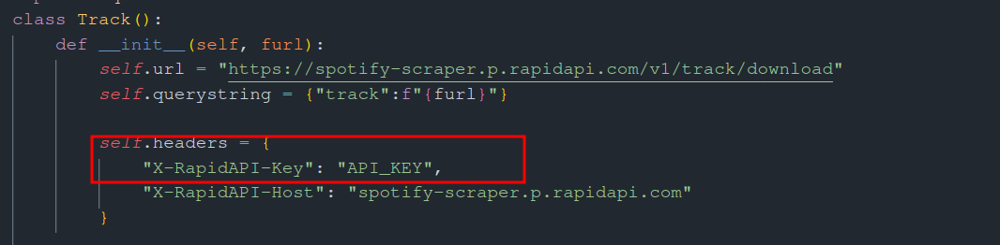
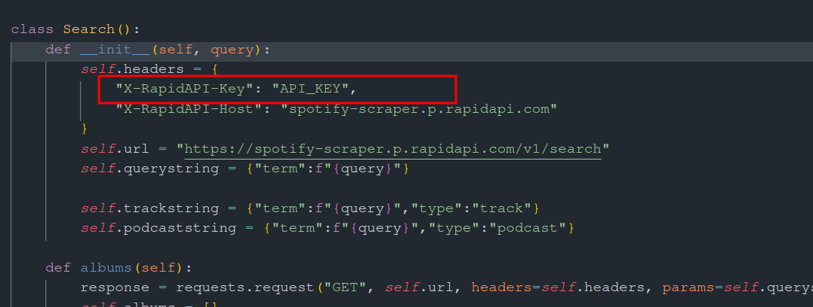

# Spotipy

A Spotify client for the terminal written in Python <br><br>
__NO PREMIUM REQUIRED!__<br>

# API

At first you need to get API for sptify from [RapidAPI](https://rapidapi.com/DataFanatic/api/spotify-scraper/)
Paste it in search.py and track.py



# Running
```
pip3 install -r requirements.txt
python3 spotipy.py
```
# Video

https://user-images.githubusercontent.com/37780087/178147868-5d5b3d9a-ad16-445a-9dc5-23fccfaf9cb5.mp4

